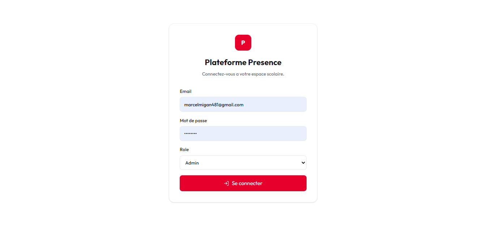
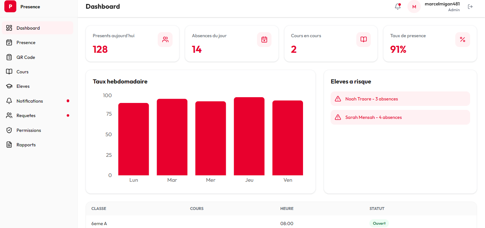

# Plateforme de Gestion de Presence Scolaire

Application frontend React.js pour la gestion de presence scolaire.  
Cette version est une V1 fonctionnelle en mode demonstration : elle peut etre lancee et testee sans backend Laravel.

## Captures

### Page de connexion



### Tableau de bord



## Objectif du projet

La plateforme permet a un etablissement scolaire de suivre les presences des eleves, de gerer les cours, de consulter les absences, de traiter les demandes et de generer des rapports.

Le backend Laravel n'etant pas encore disponible, cette premiere version utilise des donnees locales mockees afin de valider l'interface et les parcours utilisateur.

## Fonctionnalites de la V1

- Connexion demo avec role utilisateur
- Roles disponibles : Admin, Professeur, Parent, Eleve
- Dashboard avec statistiques de presence
- Graphique hebdomadaire du taux de presence
- Alertes pour absences successives
- Ouverture de liste de presence
- Marquage manuel des presences
- Generation et scan de QR Code
- Gestion des cours
- Consultation du programme d'une classe
- Gestion des eleves
- Historique des notifications
- Gestion des requetes de presence
- Demandes de permission
- Apercu et export PDF des rapports

## Stack technique

- React.js
- Vite
- React Router
- Axios
- Zustand
- Tailwind CSS
- Recharts
- qrcode.react
- html5-qrcode
- jsPDF
- html2canvas
- react-hot-toast
- lucide-react

## Installation

Installer les dependances :

```bash
npm install
```

## Lancement en developpement

```bash
npm run dev
```

Ouvrir ensuite l'URL affichee dans le terminal, par exemple :

```text
http://127.0.0.1:5173/
```

Si ce port est deja utilise, Vite ouvrira automatiquement un autre port.

## Connexion demo

En mode mock, aucun compte reel n'est requis.

Exemple :

```text
Email : admin@test.com
Mot de passe : 123456
Role : Admin
```

Vous pouvez utiliser n'importe quel email et n'importe quel mot de passe.

## Mode mock

Le projet est configure pour fonctionner sans backend avec :

```env
VITE_USE_MOCK_API=true
```

Les donnees demo sont stockees dans le `localStorage` du navigateur.

Quand le backend Laravel sera pret, il suffira de passer a :

```env
VITE_USE_MOCK_API=false
```

et de verifier l'URL API :

```env
VITE_API_URL=http://localhost:8000/api
```

## Fichier d'environnement

Un exemple est disponible :

```text
.env.example
```

Il peut etre copie vers `.env` :

```bash
cp .env.example .env
```

Sous Windows PowerShell :

```powershell
Copy-Item .env.example .env
```

## Scripts disponibles

```bash
npm run dev
npm run build
npm run lint
npm run preview
```

## Structure du projet

```text
src/
|-- api/
|-- components/
|   |-- layout/
|   |-- pdf/
|   |-- presence/
|   |-- qrcode/
|   `-- ui/
|-- hooks/
|-- pages/
|   |-- auth/
|   |-- cours/
|   |-- dashboard/
|   |-- eleves/
|   |-- notifications/
|   |-- permissions/
|   |-- presences/
|   |-- rapports/
|   `-- requetes/
|-- store/
`-- utils/
```

## Design

La charte visuelle suit une direction minimaliste rouge, blanc et gris.

- Couleur primaire : `#E8002D`
- Fond principal : `#FFFFFF`
- Texte principal : `#111111`
- Texte secondaire : `#6B7280`
- Police : Outfit
- Icones : lucide-react

## Etat actuel

Cette V1 est une base frontend exploitable pour une demonstration.  
Elle est prete a etre connectee progressivement au backend Laravel lorsque les endpoints seront disponibles.
