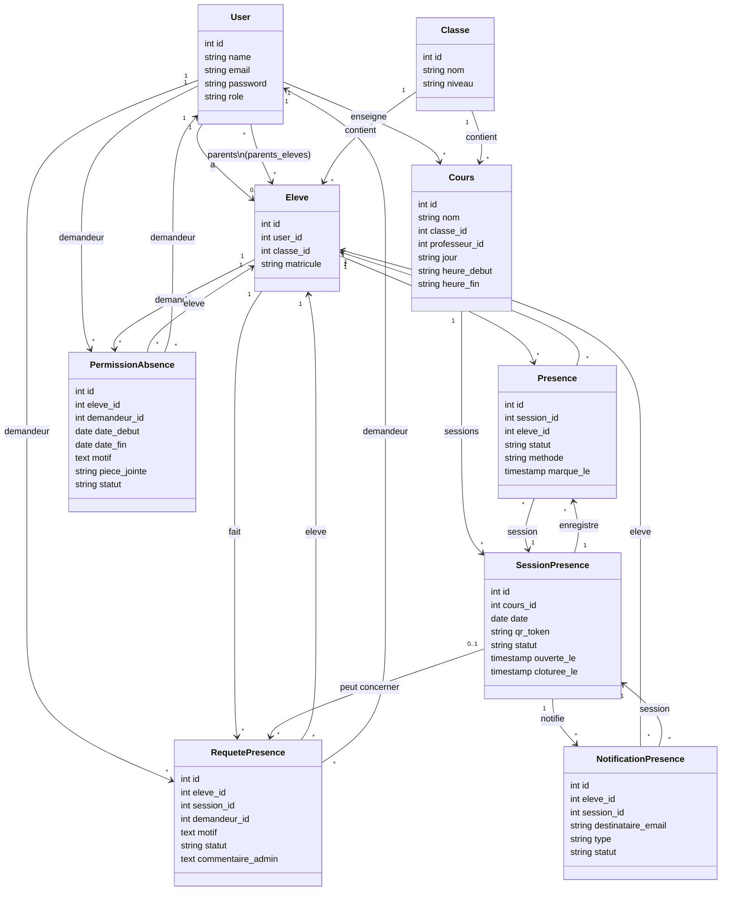

# Diagrammes UML du projet

## Diagramme de cas d'utilisation

```mermaid
%%{init: {'theme':'base', 'themeVariables': { 'fontFamily':'Inter, sans-serif' }}}%%
usecaseDiagram
  actor Admin as A
  actor Professeur as P
  actor Parent as T
  actor Eleve as E

  A --> (Se connecter)
  P --> (Se connecter)
  T --> (Se connecter)
  E --> (Se connecter)

  A --> (Voir tableau de bord)
  P --> (Voir tableau de bord)

  A --> (Gérer utilisateurs)
  A --> (Gérer classes)
  A --> (Gérer cours)
  A --> (Gérer élèves)

  A --> (Ouvrir séance de présence)
  A --> (Clôturer séance)
  A --> (Marquer présences)
  A --> (Vider les présences)

  P --> (Gérer cours)
  P --> (Gérer élèves)
  P --> (Ouvrir séance de présence)
  P --> (Clôturer séance)
  P --> (Marquer présences)

  A --> (Valider requêtes d'absence)
  A --> (Valider permissions d'absence)
  P --> (Valider requêtes d'absence)

  A --> (Consulter notifications)
  P --> (Consulter notifications)
  T --> (Consulter notifications)
  E --> (Consulter notifications)

  T --> (Soumettre requête d'absence)
  T --> (Soumettre permission d'absence)
  E --> (Soumettre requête d'absence)

  E --> (Scanner QR pour présence)
  A --> (Générer rapports)
  P --> (Générer rapports)
```

## Diagramme de classes



## Notes
- Le projet combine un backend Laravel REST et un frontend React/Vite.
- Les rôles principaux sont `admin`, `professeur`, `parent` et `eleve`.
- Les principaux flux métier sont : gestion des présences, gestion des classes/cours/élèves, requêtes et permissions d’absence, ainsi que notifications et rapports.
